Will: [0:00] Hi, my name is [Will](https://twitter.com/willjohnsonio). I'm the community engineer with egghead.io. This is our third series of our Egghead talks, Remote Conference Talks. Today, we have a double-header. We have two guests.

[0:12] How it's going to work, Nick is going to give his first talk on **everything that software engineers should know about neurodiversity.** I'm sure he'll say that better than I will. Then, we'll take some questions from the chat. You have questions, you can ask them in the chat, then I'll ask them at the end of his talk.

[0:30] Then, we have [Josh Doody](https://twitter.com/JoshDoody), who'll present salary negotiation for software engineers and then same thing, questions in the chat and then we will respond or I'll ask them at the end so everyone can get their questions asked and it won't be too much going on.

[0:47] I appreciate everyone for coming. Glad you all able to join us. We can still come together in these wild times and be able to connect and learn things from each other. Just like Josh said, I'm glad technology makes this possible.

[1:01] If you do want to discuss this on Twitter, you can use the hash tag [#eggheadtalks](https://twitter.com/search?q=%23eggheadtalks&src=typed_query), and that'll allow anyone here to connect, and we can connect outside, and things going to be good for everyone. Without further ado, I'm going to let Nick take over and share his screen and do his presentation.

Nick: [1:22] Great. Thank you so much. Everybody hear me, see my screen OK? I'll give it a second and look out into the audience and ask, but I will assume that things are good unless I hear otherwise.

[1:32] I'm here to talk to you today about **Things Every Software Engineer Should Know About Neurodiversity.** You might be forgiven for assuming that this is going to be a talk about how to write code with neurodivergent people in mind. That's not what this is.

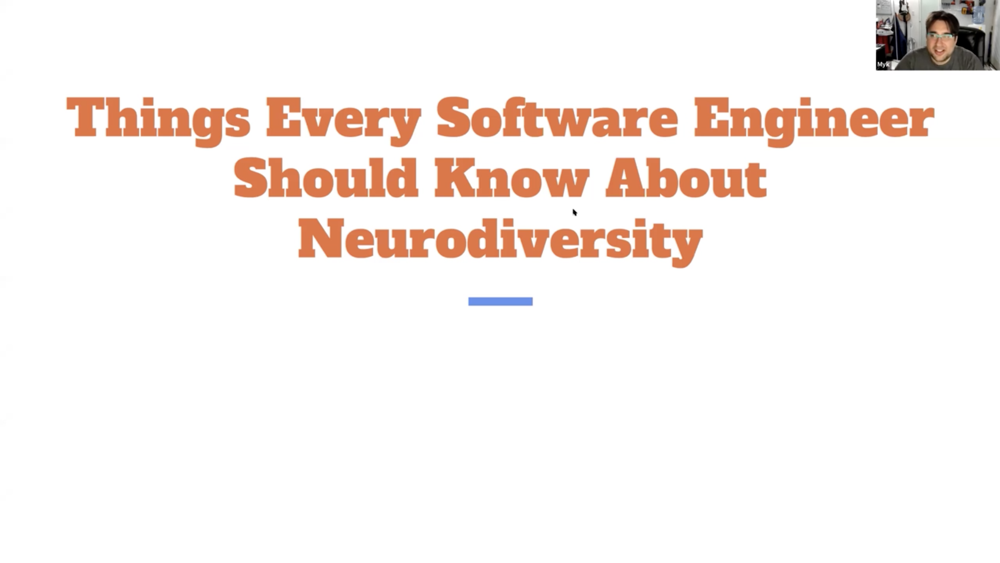

[1:47] This is a talk that I like to give to groups where I know there are a lot of people living with undiagnosed neurodivergent conditions. I myself didn't discover that I was autistic or ADHD until I was in my mid-30s, and it improved my life measurably. Since then, one of the things I like to do is give as many people those _ah-ha_ moments as I can.

[2:11] When I say "Things Every Software Engineer Should Know About Neurodiversity," what I really mean to do is ask you, **"Are you neurotypical? Are you sure?" A lot of you aren't and don't know it.** 

Who am I? Before I get too far into this, why should you listen to me?

[2:25] I'm an autistic and ADHD software engineer at Mode Analytics in San Francisco, though I live in Crown Heights, New York. My name is [Nick](https://twitter.com/mykola) on Twitter. I am constantly there. You can come ask me questions, yell at me, or whatever you feel like doing after this talk there.

[2:40] I'm somebody who's been a journey towards mental health for a really long time that I started taking seriously a couple of years ago. I'm not a doctor or medical professional, but I've had a lot of therapy.

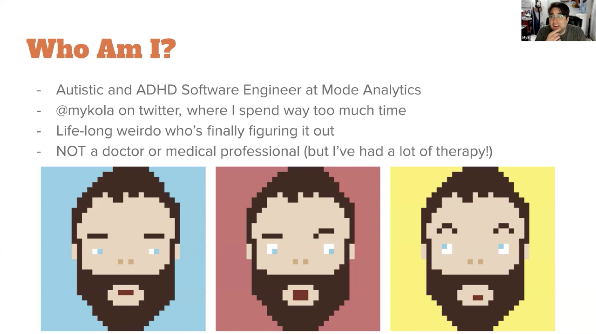

[2:50] I have learned a lot about all of this stuff. I'm eager to share it with you. Take all of this with a grain of salt. **Take all of this with the understanding that I can't possibly represent the wide variety of experiences that are out there.** I'm going to talk to you today a little bit about my experiences and give you a rough survey of what neurodiversity really means.

[3:11] When we say the word "neurodiversity," this **is meant to be understood as a subset of the biodiversity**. Just like there are different ways that people can have bodies and no one body is correct, **there are also different ways that people can have brains** because there's different ways that brains can be organized.

[3:28] **It's not necessarily an illness or a disease if somebody's brain's different from a typical brain**. Most people's cognition and senses work more or less the same as everyone else's. We call these people **neurotypical**. Other people have various conditions or experiences which cause their brains to work a little bit differently than everyone else's. We call these people **neurodivergent**.

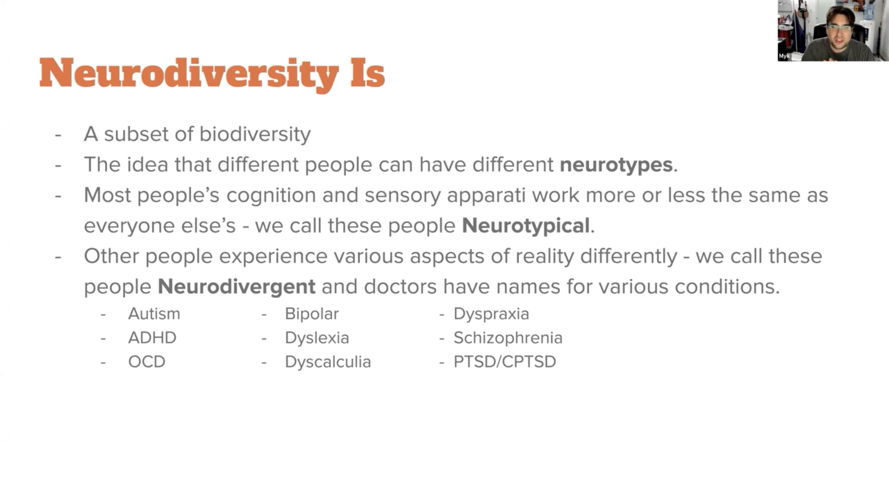

[3:51] Neurodiversity is the idea that there are any number of different neurotypes out there and that they're all valid. **It's not a disease if you're different. It's just a way of being.** It might come with challenges. You don't have to feel bad about it. There's ways that you can thrive.

[4:06] I want to throw this visual in here real quick because I find that this really helps the visual thinkers. If you think of the brain as a mixer for some sound, you can think of a **neurotype as the current position of all of these different switches**.

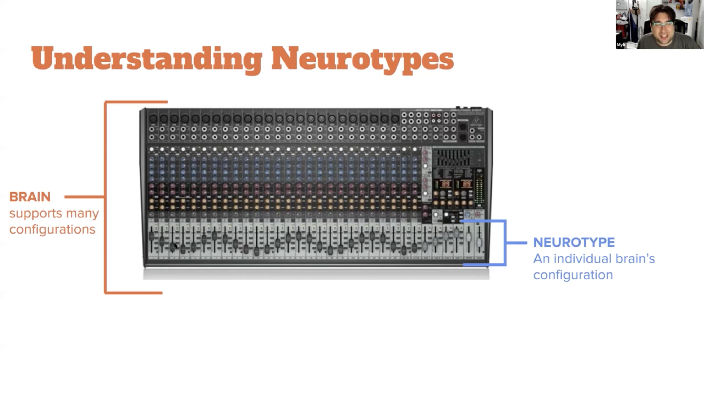

[4:23] For most people, let's say, these switches down here, these sliders. Some are going to be a little higher. Some are going to be a little lower, but they're all going to be around the center. Maybe one of these represents how bright lights look.

[4:33] Maybe one of these represents how well you can handle your strong emotions. Maybe one of these represents your capacity to read between the lines when people are talking. *Some people are way turned up. Some people are way turned down.*

[4:47] When you have enough of these different traits that you don't have in common with the people around you, your experience of life and reality tends to diverge from there. The more different you are, the more it diverges. That's what we're talking about when we talk about neurodiversity and neurodivergent conditions. Let's learn some words. **A lot of this is very much about vocabulary**.

[5:10] One of my most rewarding experiences since I've started doing outreach work in this space is conversation after conversation where I get to see somebody go, *"Oh. There's a word for that? I've been struggling with that my whole life."* That's the feeling I want to give to as many people as possible.

[5:26] This talk is going to be a high-level survey of a bunch of concepts. I'm going to throw a bunch of names at you. Most of this is probably going to bounce off of you, but for some of you, **some of this is really going to resonate**. You're the ones who this talk is most for.

[5:40] Everyone else, there's so much that you don't know about the experiences of the people around you that it would really stun you, I think. I thank you very much for your interest and for paying attention. Let's look at some words.

[5:54] First, let's talk about some of these medical diagnoses and syndromes that we see thrown around. This is just going to be a subset. **This is not going to be an exhaustive talk.** None of the lists I show you are exhaustive. That's important to understand as we step through this.

[6:10] Let's start out by mentioning **autism** but not actually saying much about it. It's hard to define. If you go on Twitter and ask, "What is autism?" you'll get a hundred answers from a hundred people. They'll be different, and they'll have a lot in common.

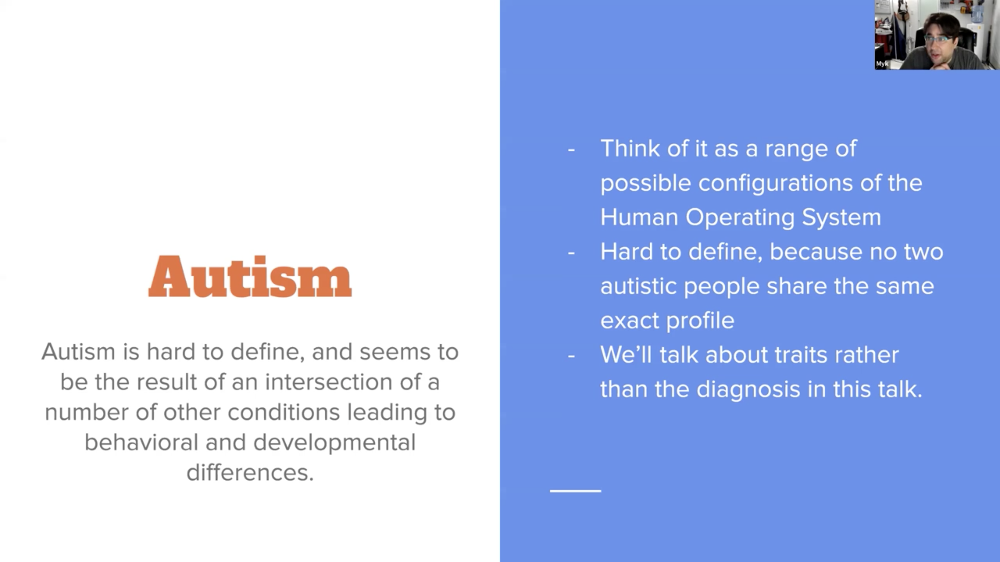 

[6:25] What I have found is that **it makes a lot more sense to talk about autistic traits** and what it means to have specific traits than it does to talk about autism itself as a thing. However, autism is still a thing. It's a thing the medical community names. It's a thing that a lot of us have claimed as an identity. We'll get a little bit later into what exactly autism is.

[6:47] **ADHD** is one of the worst-named conditions in the history of medicine. We think of it as, "Oh, the kid who can't sit still in English class." Really, this is a **nuanced and pervasive difference in the way the brain processes time and attention**.

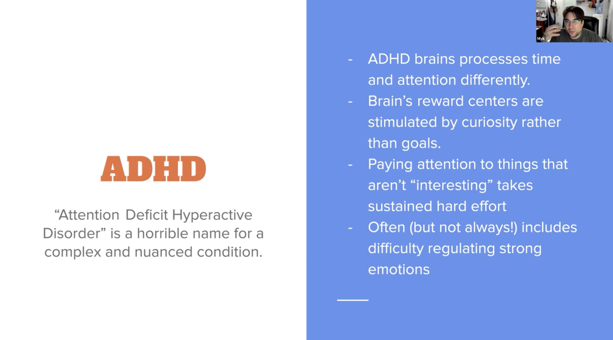 

[7:03] ADHD means that your brain's reward centers are not stimulated by achieving goals. You don't get dopamine for finishing the task in front of you. **You get dopamine from satisfying your curiosity.** It's the only thing your brain cares about.

[7:16] Paying attention to things that you're not curious about takes a lot of work, energy, and effort. It's actually really hard. **This can also lead to difficulty regulating emotion.** We're going to talk about some emotional stuff coming up in a little bit.

[7:30] **Bipolar disorder.** People who have bipolar have wildly fluctuating emotions that can be really difficult to regulate. There are different bipolar profiles. Some people have **hypomania**, which is this slightly elevated state, where you're focused, attentive, and a little bit manic. You're mostly fine. Maybe you're not paying attention to everything you're supposed to be. Then maybe sometimes you're wildly depressed.

[7:54] **Other people have bipolar where, when they're manic,** they're hyper-manic. It is **indistinguishable from psychosis**. They are seeing things that aren't there. They are talking to people who aren't there. It can be really scary and dangerous.

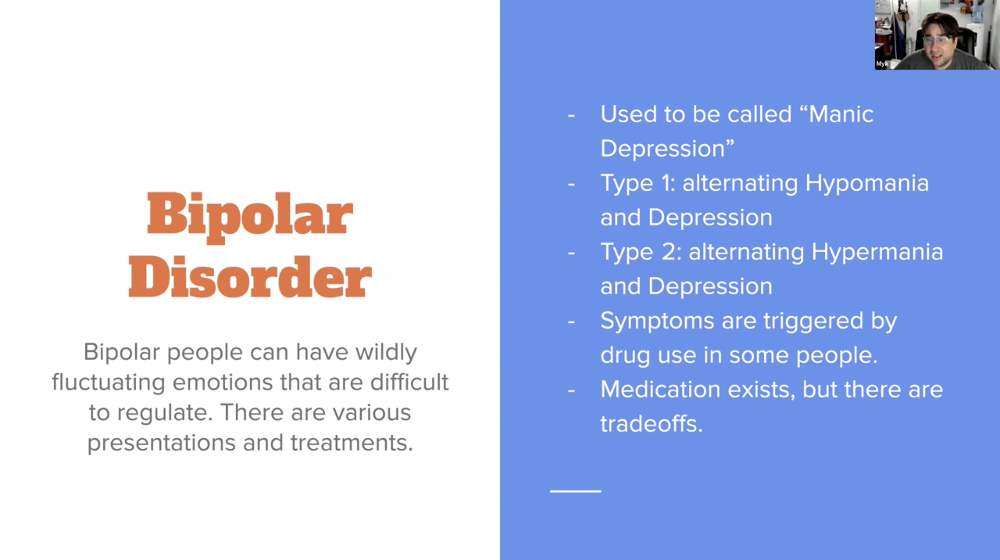 

[8:06] It's something that can be medicated, but medication is a trade-off always. There's side effects in everything. **This is an experience that a lot of people are dealing with around you that you might not realize.**

[8:17] With things like **dyslexia** and **dyscalculia**, I don't mean to collapse or group these things together. There's a bunch of these conditions that happen. **If your brain processes information at one speed but your senses provide information at another speed**, you get this impedance mismatch.

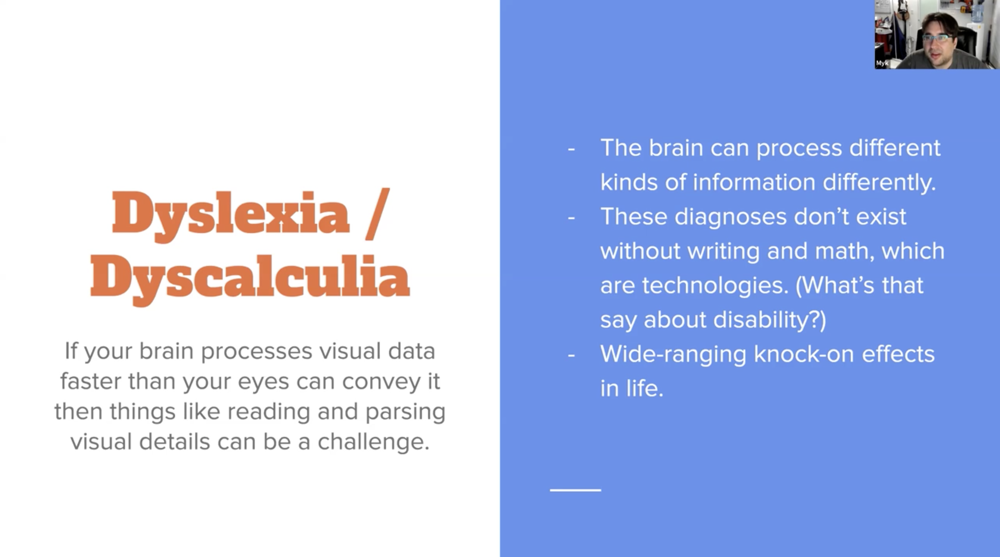 

[8:33] Somebody with dyslexia, his brain is **processing the words that they're reading so fast that they're actually having thoughts and ideas about what they've read in the space between**, say, one word and the next word. It becomes very difficult to slow down enough to pay attention to what you're looking at.

[8:49] **Dyscalculia are people who really struggle with processing numbers**. This isn't just having a hard time doing math homework. This is when we look at a clock. It takes you a little longer. Maybe you feel some shame around this. There's nothing to be ashamed of. Something I want to call out here. These really get at the heart of what a disability is.

[9:12] I want you to pay attention to the fact that, without writing, there'd be no such thing as dyslexia. Without math, there'd be no such thing as dyscalculia. These are human technologies that were invented. **Now we have disabilities that are named for people's inability to use these technologies.**

[9:28] I'm not going to get into the social model of disability versus the medical model of disability much in this talk. If you find that interesting, **google the social model of disability**. There's a lot there to learn. Sensory processing disorders. If you remember our little mixer board from earlier, I said some people are turned way up. Some people are turned way down on different traits.

[9:50] Sensory processing is really common for this. Some people experience certain senses really, really, really strongly. Some people experience them really weakly. **Some people experience some things very strongly and some things very weakly.** 

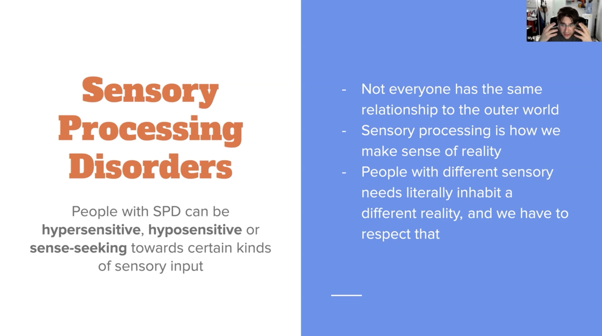 

[10:03] You might get a blinding headache if somebody turns on lights in the room, and you're not wearing glasses. Or, you might not feel it when somebody taps you on the shoulder. There's all these different ways of being.

[10:17] I tend to **include emotional challenges** in this as well because I tend to think of emotions as senses that are **calibrated for external state changes instead of internal ones**, and so I find that if you're hypersensitive or hypersensitive at certain emotions, to me it makes sense that that will fall into this category.

[10:36] Let's talk about **OCD** a little bit. This often like a punch line used in pop culture on so we'll see about this. **OCD is not a joke. This is a desire to be absolutely certain about something where you feel like if you're uncertain, something bad is going to happen.** You can't say why but you have to be sure.

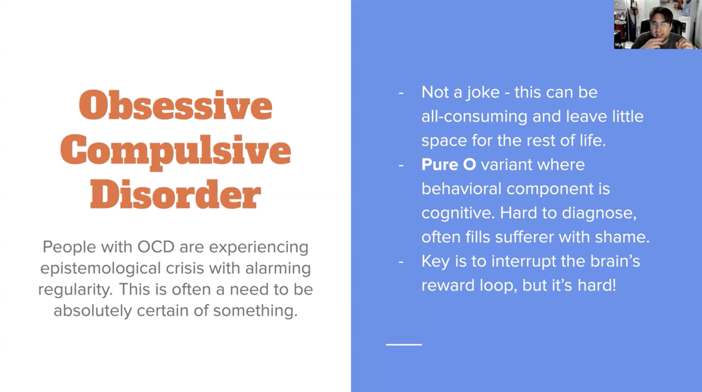 

[10:54] It can be all-consuming. I want to take a moment and specifically call out something called Pure O OCD. They initially thought there are some people who are only obsessive. They've since understood that what's actually happening is the behavior and **Pure O OCD is invisible because it's cognitive**.

[11:12] Here's what Pure O OCD looks like. You think a horrible thought. Something that you don't want to be true. *"Oh my God, I did this horrible thing that I know I didn't do."* Then your brain is like, *"Oh no,"* and you start talking yourself out of it.

[11:27] No, I know this true because I have this evidence and this and this. *"This is fine."* Then you get this huge surge of relief and your brain's just learned, *"Oh great, I can get dopamine, whatever I want just by telling you this thing you're really afraid of then you'll talk me out of it."* 

[11:41] I spent 15 years tracking the hell of this and it's real. The way that I got out of it was I learned that you don't have to argue with your brain. Your brain can say, *"Hey, you're horrible,"* and you can say, *"Yeah, you know what? I'm actually worse. I'm worst that horrible. I'm worst than you think I am."*

[11:55] Your brain goes, *"Wait, what? All right, this isn't fun anymore."* It stops. It worked for me, it's probably going to work for everybody. **This stuff is so serious.** It comes to thing that dominates your life.

[12:09] **PTSD is what happens when you experience something so horrible that you can't process it.** You've been assaulted or you got into a car accident, or something. Something happened that was so bad that every time you think about it, you're spiraling.

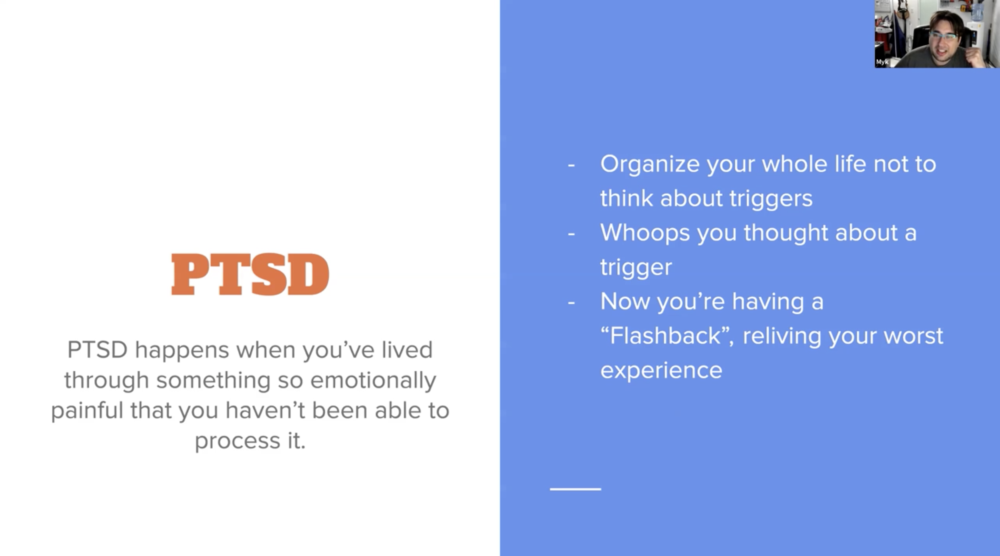 

[12:24] You organize your life not to think about it. Then the longer you go, what happens is this thing that you're so afraid of becomes this whole center of your life that you're not even thinking about. You've forgotten about it, maybe.

[12:36] Then something reminds you of it and oh my God, you're right back there in the worst day of your life having a flashback. You are literally experiencing the same emotions, the same feeling of danger. This is catastrophic and horrible. People who live with this are working so hard.

[12:54] Complex PTSD is a variant that is sort of coming out now and being recognized for the first time. Where normal PTSD is what happens when you have a bad experience of some sort, it's really bad, complex PTSD is when you experience trauma for a sustained period of time.

[13:11] It's not that you have one bad experience, it's that every day you woke up and you felt this horrible thing. You went to bed and you woke up the next day and you felt this horrible thing. It's an emotional state that you were in.

[13:22] With CPTSD, what happens is you get emotional flashbacks. Your boss might give you some feedback on your work, and suddenly you're remembering how you had a teacher that traumatize you and made you feel so small every time you made a mistake. Now, you're in your office trying not to cry because you got good feedback and you don't know what's going on.

[13:42] It's called an emotional flashback. It's really devastating. I'm going to recommend again Pete Walker's "Complex PTSD: From Surviving to Thriving," is a book that I recommend everybody to read, honestly. It talks a lot about this.

[13:57] That's it for diagnosed conditions that I want to mention. There are others. Again, it's not exhaustive. More interestingly to me at least, I want to talk about neurodivergent traits. We can talk about ADHD but ADHD is just a term for people who have a set of traits that happen or occur together. Then we circle that and we call that ADHD.

[14:20] A lot of the work in neurodiversity now seems to be suggesting that grouping traits together and circling that and calling it a thing isn't the best way to reason about this. Insurance companies really love it. This is something to keep in mind, is that where these taxonomies come from and who creates them is largely driven by agendas at every level. It's worth being aware of.

[14:45] We're running a little behind here so I'm going to try to rush through some of these. If you've got ADHD or time blindness, you don't experience subjective time the same way. One hour could feel like two minutes, another hour could feel like four hours. You can't trust yourself to know how much time has passed.

[15:03] That's fine. It's because you're living your life and you're spending your cycles on other things but it means that it matters to you to be on time to places, wherever, you need to set alarms, stuff like that.

[15:16] Face blindness or prosopagnosia. Not everybody can easily recognize other people. I like to joke that I watch "Dead Poet's Society," the Robbie William's movie. I have no idea what was going on because it's like six fat boys wearing the same uniform with same haircut, the same tie, and the same smirk.

[15:35] I have no idea who's who. They all look the same. That's me. A lot of neurodivergent people don't have face blindness or any of these things. Each of these things can vary independently and individually.

[15:46] Aphantasia. Not everyone can visualize things in their mind. I'm not a visual thinker at all. I am able to see connections between ideas and I say see but it's not visual. I'm bouncing between things. I have this idea space when I think but I couldn't, for instance, remember dinner last Saturday and look down and think about any detail at all that I didn't unconsciously remember at that time.

[16:11] I don't know what was on the table. I don't know where I was sitting unless I paid attention to that detail and remembered it, I can't call up a memory and answer questions.

[16:22] A lot of autistic people can. A lot of autistic people have really good visual reasoning and are able to not only call up a memory but to make up an artificial scene and even play it through time and watch how it works. Temple Grandin famously did this and this lead to a lot of her career success.

[16:43] Sleep problems. If you're neurodivergent, you probably have sleep problems, chronic insomnia, delayed sleep-phased syndrome, chronic fatigue which compounds everything. Maybe you need more sleep than normal. Maybe you can't fall asleep before 4:00 AM but you still got to be at work on time. These are things that a lot of your coworkers are struggling with.

[17:00] Digestive problems. Do we all know that irritable bowel syndrome is a catch-all term for you get stomachaches and your poop sucks? Doctors don't know what it is. It's like inflammatory thing that seems to be correlated with stress.

[17:12] A lot of neurodivergent people are living very stressful lives and have digestive problems. It's sort of an inside joke.

[17:21] Rejection sensitivity, on the other hand, is no joke. If you spend a lifetime being corrected constantly because you are autistic, because you're ADHD, because your interpretation of things is never quite what other people's is then what happens is you don't develop the ability to be right and confident about the fact that you're right.

[17:40] Instead, you rely on other people to validate what you've said and to justify...your sense of self-worth and identity is then situated in other people. When other people don't approve or don't agree with you or don't grant you approval for some idea, to you it doesn't feel like, "OK, then. I don't want to do that."

[18:00] It feels like, "Oh, no, I can't exist. There's no room for me in this universe. I have been negated at a personal level. I'm having an identity crisis because my coworker didn't want to do things this way." This is a real thing that people you know struggle with.

[18:19] Toxic shame is deeply related to all of this and related to CPTSD and rejection sensitivity. Shame is like an emotional tool that we use to teach people how we want to be treated in public.

[18:29] You give somebody shame when they do something that hurts you. But if you grow up constantly being corrected, constantly being shamed, then what you're learning is just existing is something that you should be ashamed of.

[18:44] There are a lot of people going through life who don't even realize that they're ashamed of being who they are. All they want to do is hide and mask and cover up who they are.

[18:55] Sensory overload. The stance to reason. If some people are much more hypersensitive to certain emotions or certain sensory stimuli, then they're going to get overloaded. Like lights, loud sounds, strong emotions can lead to meltdowns or shutdowns.

[19:09] It's the body literally being unable to continue to function until it finishes processing everything in its cue. It's embarrassing. It's excruciating. It's also why we don't make fun of bottle sunglasses.

[19:20] People who are sensitive to light are sensitive to light, and it hurts. They cannot function if they don't accommodate that.

[19:27] I want to talk about dead time. If you got ADHD and it's 10 o'clock in the morning and you got to do something at 2 o'clock, there's a good chance you're not doing anything between 10:00 and 2:00.

[19:36] That's called dead time. You just don't feel comfortable starting something because you know you're going to have to stop it and do something else, and it can be hours or days. It's horrible.

[19:46] Finally, masking is the process where people who have neurodivergent traits pretend they don't. You do it in order to fit in in order to avoid social consequences, but if you do it too much or if it becomes who you are, then it can be really destructive.

[20:00] There is this passing privilege analogy where if I'm an autistic person and people who meet me don't know that I'm autistic generally unless I tell them, I can pass because I know how to mask. I also thought that I was my mask for 25 years, and let me tell you, that has taken some real work to like untangle for myself.

[20:20] Real quick, let's step through some specifically autistic things, special interests in hyper-focus. Our brains unfurl into the things we're paying attention to.

[20:28] When I'm working on something, I am thinking about every part of it. I am modeling it in my head six ways from Sunday, and I am in it, whether this is for work or for fun. I'm playing a video game, I'm coding a project, I'm just in it and I can do it for hours. It doesn't matter.

[20:45] Autistic communication. The cliché is, autistic communication sucks, right? The thing is we notice different things than you do and so when we use words, those words don't always refer to the same things that they do when you use them.

[20:59] We might have an interaction, think we've understood each other, and then it turns out we were talking past each other the whole time. Then, of course, because there's more of you than there are of us, we're the ones who are wrong and are often facing consequences for miscommunication, which is not our fault. It exists in the relation between us.

[21:17] If you do have autistic coworkers, please extend them the courtesy of giving them time and patience for communication.

[21:25] Autism and gender. Gender is a social construct. Autistic people experience social constructs differently. Therefore, autistic people are eight times more likely to be trans.

[21:34] Autistic people experience things differently and masculinity, and femininity, and gender norms as described are not experiences that a lot of autistic people have in the same way that other people do. There's this concept of auto gender. The gender that only autistic people experience.

[21:52] I want to talk about artistic inertia, which means when you're doing something, it's hard to stop and when you're not doing something, it's hard to start. This is how I spend my days.

[22:01] is when the existence of an autistic person in a holistic world requires sustained energy every day, and one day that person runs out of energy. They go to reach for that mask and it's not there. This happens.

[22:18] If you go on autistic Twitter and find everybody over age 35, they're freaking out about how to get over their autistic burnout. It's tragic. It leads to high suicide rates. It's not something most therapists have ever heard of, and yet here we are.

[22:36] When an autistic person in particular moves from a school or home environment to a professional environment, it can be a huge culture shock. A few of the things I had to learn through trial and error when I first entered the workforce were how to prioritize the feelings and reputation of other people over correctness.

[22:55] I had to learn that when somebody came up to me to give me a compliment, it's because they had a criticism that they were about to give me. I couldn't just be all proud of the compliment, ignore everything they were saying, they're trying to communicate with a compliment sandwich.

[23:09] There was a lot of like, "Everybody's so stupid. Why don't they see this without the self-awareness of realizing that when they looked at me, they thought, 'Oh, God, that guy doesn't get it. Why doesn't he get it?'"

[23:20] There's just the custom fatigue of masking and socializing with non-autistic people all day every day. It's seriously hard and unless you know this going in, if you don't know you're autistic and you're trying to do all this, you just feel like there's something wrong with you. There's not. You're just different. You have different needs. It's cool.

[23:39] That was the list of terms. Now what? I've got three little steps I want to leave you with. Number one, believe people starting with yourself. Subjective experience, I'm going to say this very slowly, subjective experience is inaccessible to science and medicine.

[23:56] Nobody can prove to you how they feel. That means you have to believe them when they tell you, especially kids. Because when kids are told that like, "Oh, no, that doesn't hurt. No, that's not a problem," what they're learning is that their needs don't matter.

[24:11] What they're internalizing is that they should just minimize their own very real needs for the rest of their lives, and they're not going to spend decades in therapy on learning the addiction and toxic coping mechanisms that they adopted in order to deal with that. Just believe them.

[24:25] Step two is, accept people, also starting with yourself. It's not enough to believe that somebody is different. You have to accept that. That's who they are. They're doing their best. They're not trying to upset you. They're not living their life in a way that you don't like for any reason other than the fact that they're doing their best.

[24:46] Many disabilities are invisible, and you never know what people are dealing with, so just accept people as they come unless they're hurting you.

[24:53] Finally, last thing I want to leave you with is that the greatest gift we can give each other is to make each other feel safe. Polyvagal theory is at the core of modern research into trauma and it basically argues that we are not able to be our best or full selves unless we feel safe. Making each other feel safe is the best thing that we can do.

[25:14] If you want to be a good ally to your neurodivergent peers and colleagues, make sure that you create a safe space for them. Let them know, "It's OK for you to be autistic here. It's OK for you to get upset. You don't have to hide it. It's OK if I didn't understand you. We can clarify this miscommunication. I'm not going to judge you if you frame the question in a way that like I wouldn't have framed it."

[25:35] Making each other feel safe is the best gift we can give each other. That's my talk and thanks so much for coming. I'm going to take some questions now.

Will: [25:43] Cool, thank you a lot, Nick. I learned a lot. I feel like I have that thing too when there's time in between I don't want to do anything. I'm like, "I can't start this because I got to do something now." I learned a lot. That was a really good talk.

[Nick]: 26:00 Thanks so much.

[Will]: 26:01 Did anyone have any questions? Rochelle says she's recently discovered she's struggled with dyscalculia for all of her life. What are some good coping mechanisms?

[Nick]: 26:17 That's a good question. I wish I knew. Dyscalculia and dyslexia are not things that I'm personally familiar with but what I do recommend is that you go on Twitter and you find other people who are talking about these things. I would not be doing as OK as I am if I hadn't found other autistic and ADHD people online.

[26:36] I've gotten much more help from other people like me than I have from doctors or therapists. The biggest takeaway is that there's nothing wrong with you. It's how tour brain works . It's cool. You're great.

[Wil]l: 26:48 Thank you. Matthew asks, do you feel like time blindness is true for most people? Humans seem to be bad at estimating timeframes.

[Nick]: 27:01 Yes. All of these traits are things that everybody's going to happen to some extent or another. What makes somebody neurodivergent is the extent to which these traits impact your life.

[27:14] If you're somebody who sometimes loses track of time when you're playing a phone game or whatever, but you're never late to meetings, or you don't get confused, it's not a thing that impacts your life, I don't know, you can call yourself time blind if you want, but it's not quite the same thing.

[27:31] Another thing that you often hear, I often hear as an autistic person, "Everybody has those traits." To some extent, that's true, but I guarantee you that not everybody has them to the same extent. I guarantee you that people aren't organizing their lives around them, which is what we're talking about here.

[Will]: 27:55 Then we have one more question. I do apologize if we can't get to all of them. The last one we want to do is, can you suggest any further reading which can be a handout just to have some information on hand?

[Nick]: 28:13 There's a bunch of places. I should have prepared some resource links in my deck, actually. I have some. The thing is, there's so many, so what I recommend that you do is just search social media for these terms that you'll find in this talk, and find people who are talking about them.

[28:34] That is the way that you're going to find the people who are most informed about the things that are most relevant to you. Think of this talk like a survey/high-level index that you can now use to investigate Reddit, and Twitter, and Facebook groups for other people in these spaces and get their advice

Will: [28:53] OK. I thank you. That's all the questions we have for Nick's talk. That was very informative. I went ahead and posted a link to your Twitter there so if any wants to follow Nick and may have any follow-up questions and maybe he can find resources for you or whenever that may lead to.

[29:13] I thank everyone for the questions and sticking around. The next talk that we want to have is from Josh Doody. He's going to do a talk on salary negotiation for web developers.